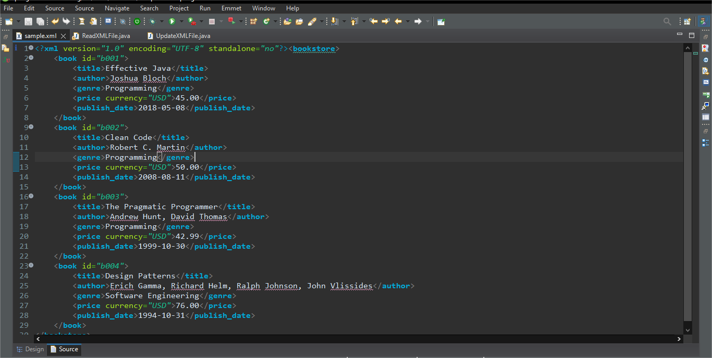
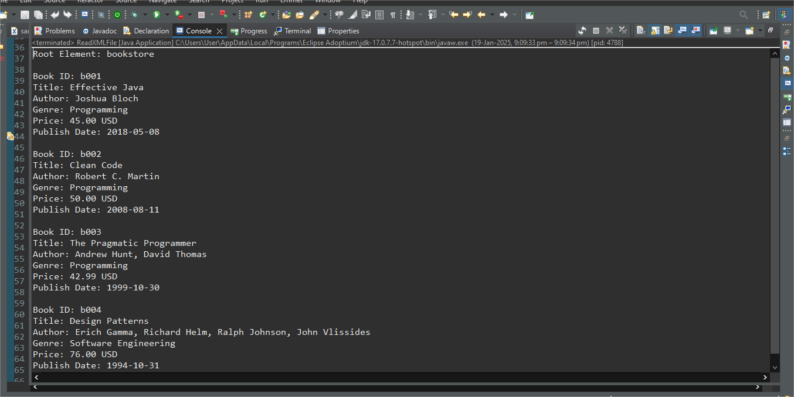
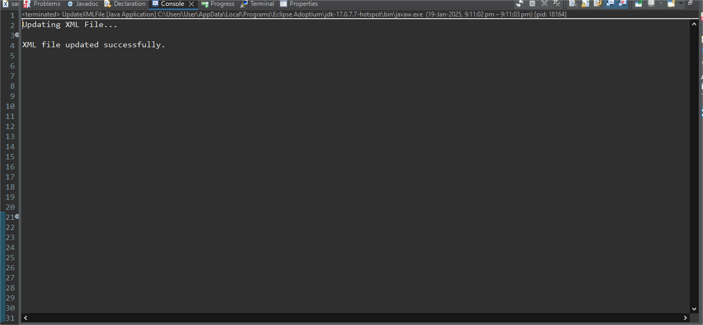
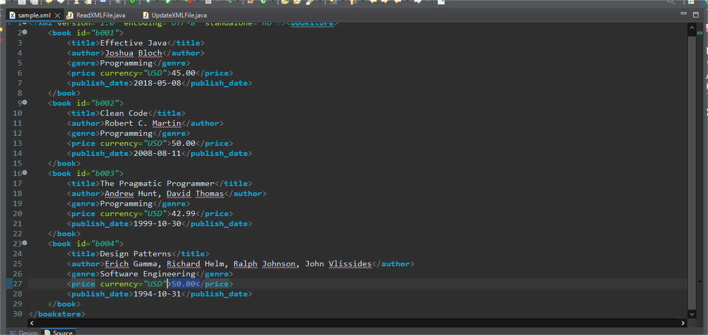

# XML Parsing in Java

This project demonstrates how to parse and manipulate XML files in Java using the **DOM (Document Object Model)** parsing technique.

## Project Overview

This project showcases how to read, update, and manipulate XML data in Java. The key features include:

1. **Reading an XML file**: Parse an XML file and extract data from it.
2. **Updating an XML file**: Modify XML content such as updating values in an existing XML structure.
3. **Writing back to XML file**: After modifying the XML data, write it back to a file.

The DOM parser provides an in-memory representation of the entire XML document, allowing us to navigate and manipulate the XML structure easily.

## Features

- **Read XML File**: Extract data from an XML file, like book details, and display it.
- **Update XML File**: Modify existing elements (like changing the price of a book).
- **Save Changes**: Write the modified XML back to the file.

## Technologies Used

- **Java**: Core programming language used for parsing XML files.
- **DOM (Document Object Model)**: Technique used for parsing XML in this project.

## Setup Instructions

### Prerequisites

- Java 8 or higher installed on your system.
- Maven or any other build tool (optional, if you are using a build tool).
  
### Steps to Set Up
1. Clone the repository:

    ```bash
    git clone https://github.com/02ananyaa/XML-Parsing.git
    ```

2. Navigate to the project directory:

    ```bash
    cd XML-Parsing
    ```

3. Compile and run the Java files using your IDE (e.g., IntelliJ IDEA, Eclipse) or through the command line.

4. Ensure you have the **JDK** installed to run the project.

## How to Use

1. **Read the XML file**: The project reads an XML file, parses its contents, and prints the values of different tags.
2. **Modify the XML file**: The project allows for modifying values in the XML, such as updating the price in a book entry.

## Screenshots

### 1. Sample XML File
This is the sample XML file used as input in the project:



---

### 2. Reading XML File
This is the output after reading the XML file:



---

### 3. Updating XML File
This is the process output while modifying the XML file:



---

### 4. Updated XML File
This is the final updated XML file reflecting the modifications:


